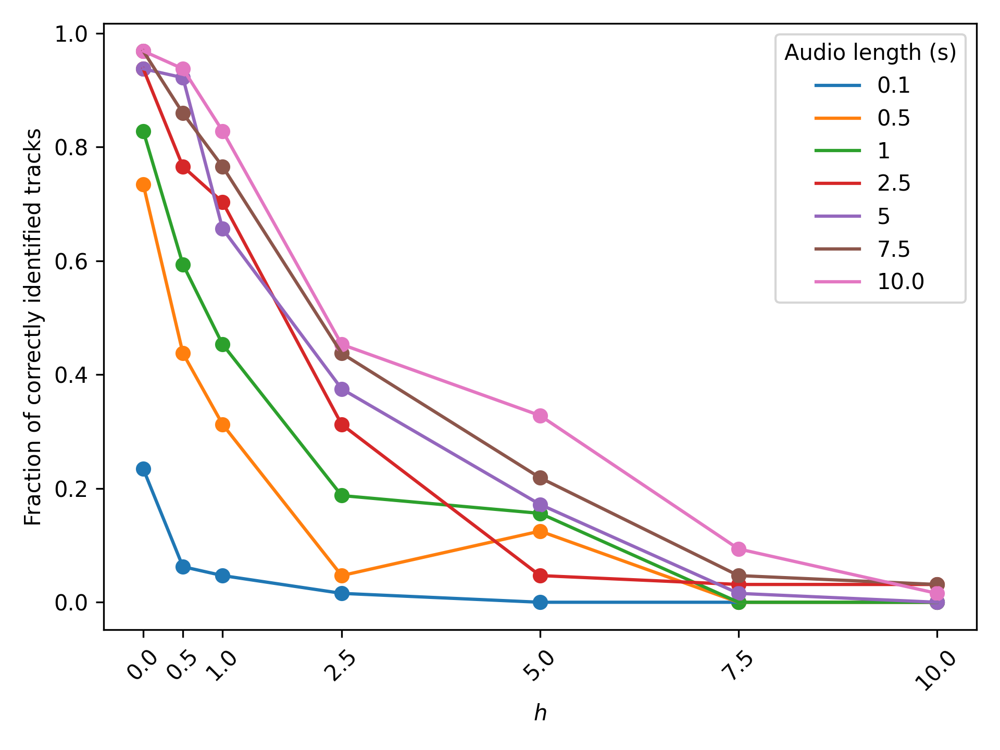

## Fast Fourier Transforms and rapid audio comparison

This repository contains the code for my IB Math Extended Essay focused on the following research question: _"How can Fourier transforms be used to efficiently represent and accurately recognise audio signals?"_

In my 42-page paper, I described the working and implementation of the Fourier Transform to generate frequency domain-based signatures of a database of discrete audio signals. I then used these signatures to rapidly identify arbitrary clips of audio from the database, achieving up to 96.875% accuracy on 10-second clips and 93%+ accuracy on 2.5-second clips.

_Evaluation of recognition performance. 7x7 = 49 combinations of audio clip length and relative energy of random background noise ($h$) are tested. A maximum accuracy of 96.875% is achieved. For length > 0.5 seconds, random chance recognition 1.56% is outperformed for all $h < 7.5$._

_A plot of the results from the above table_

The repository is structured as follows:
- `dft_fft/`: Comparisons of the efficiency of custom implementations of the naive Discrete Fourier Transform algorithm and the Radix-2 Cooley-Tukey Fast Fourier Transform 

`audio_recognition`:
-  `audio_file_scraper/`: A Python webscraper to scrape and download public-domain audio from the [Open Music Archive](https://www.openmusicarchive.org/index.php)
-  `fingerprint_utils.py`: Utilities for generating spectrograms (i.e., frequency domain representations of discrete signals) and string 'fingerprints' of audio clips
- `recognition_utils.py`: Utilities for generating and matching signatures from arbitary audio clips to existing database signatures, for generating random clips for testing, and for adding random Gaussian noise (white noise) to the background of audio tracks to increase the difficulty of recognising them
- `main.ipynb`: IPython notebook to execute and evaluate the recognition system
- `noise.ipynb`: IPython notebook to test and visualize the white noise features.

The full paper is available in the root of this directory (`extended-essay.pdf`). Further details, including citations, can be found in this document.

